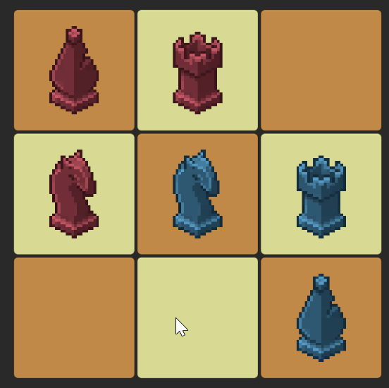

# Strategy Overview

I aimed to create straightforward code that incorporates essential design patterns. In the data section, I modularized implementations that can later be applied to gameplay elements like the Piece, including Player Data, Piece Data, Bot algorithms, etc. This approach decouples these elements from MonoBehaviour, facilitating easy plug-and-play functionality.

In some instances, I utilized `OnValidate` to demonstrate how changes in MonoBehaviour data automatically update visuals. Typically, I use `[OnValueChanged]` from NaughtyAttributes or the Odin plugin. However, for this test, I opted for `OnValidate` to avoid external plugins.

Due to time constraints, I did not implement unit tests. Instead, I developed a simple algorithm for a bot that selects a random move from all possible options. My plan was to introduce a medium difficulty level by assigning scores to each move.

I thoroughly tested the game to prevent bugs. However, I discovered a potential softlock issue when a knight is placed at the center of the grid.

# Code Structure:

* **Core:**
    The most important components go here.
  * **GameManager**: Controls the gameplay flow (Initialization, Start Game, Player Turn, Game End).
  * **BoardController**: Implementation of the generic GridSystem. Controls the placement of pieces on the board and checks for win conditions.
  * **BoardCell**: Used by BoardController to receive player inputs when moving pieces on the board.

* **Data:**
    ScriptableObjects used in the game.
  * **BoardData**: Defines the board size and visuals (color of check squares).
  * **PlayerData**: Defines the player name and color.
  * **PieceData**: Abstract ScriptableObject that defines the piece shape and implements the valid positions a piece can move to. Each piece has its own implementation.
  * **BotAlgorithmData**: Abstract ScriptableObject that defines the algorithm used for the bot to choose the next move.

* **Gameplay:**
    Gameplay elements in the game.
  * **Piece**: Contains the PlayerData and PieceData for each piece.
  * **PieceDragHandler**: Inherits from Piece to add dragging capabilities to a piece on the UI.
  * **PlayerInteractionHandler**: Controls each player's piece interactions, enabling and disabling dragging according to the current turn.

* **UI:**
    UI elements like popups, screens, etc.
  * **UIActivePlayerBanner**: Indicates the active player.
  * **UIPlayerWinScreen**: Displays the winner screen.

* **GridSystem:**
    Generic grid system used by any game based on a grid.
  * **CellGrid**: Main class managing the grid itself.
  * **ICellElement**: Generic interface to manage cell elements inside the grid cells.

* **Utility:**
    Helper static classes with common code used by the other subsystems.
  * **AIBoardGridHelper**: Contains methods to calculate valid movements, win conditions, etc., all related to the grid.
